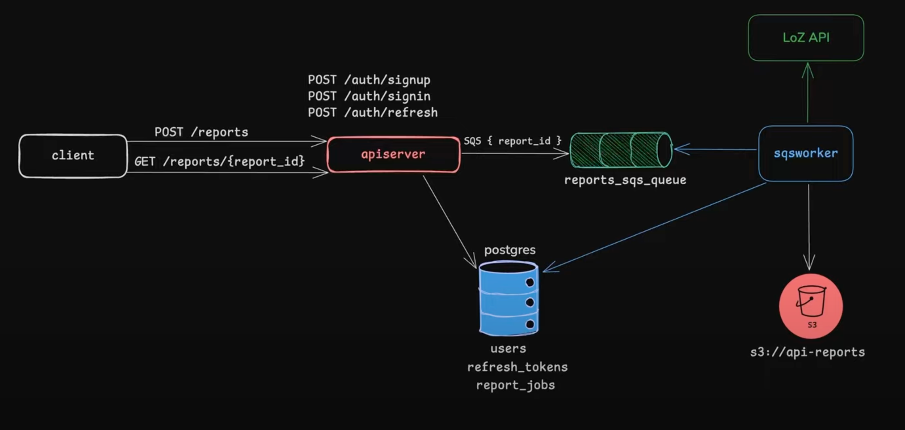
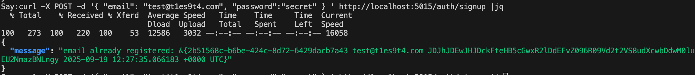

This API will complete async report generation for the client to download.

I'll handle authentication with JWT, use Docker for Postgres and Localstack, setup an SQS worker for async processing, go over testing.

1st connection to database is set with info from env files through migrations files

"curl -X POST -d '{ "email": "test@t1es9t4.com", "password":"secret" } ' http://localhost:5015/auth/signup |jq"  --- for testing my endpoints

